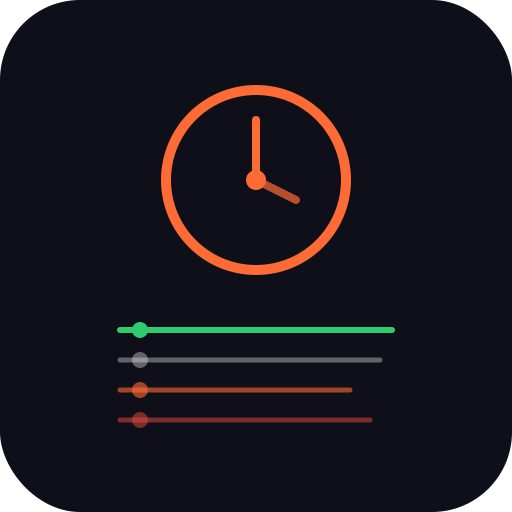

<div align="center">

# ⏱️ Cron Log Viewer

[](https://github.com/soumendrak/cron-log-viewer/releases)
[](LICENSE)
[](https://soumendrak.github.io/cron-log-viewer)
[](index.html)

<!-- SVG Logo -->


**Browse, filter, and inspect cron job execution logs — no dependencies, one file, ready to deploy.**

</div>

---

## ✨ Features

- **Pre-populated sample data** — 10 realistic cron log entries demonstrating every feature
- **Table view** with columns: Job Name, Status, Exit Code, Duration, Timestamp
- **Filter by job name** — live text search across all entries
- **Filter by status** — show All, Success, Error, or Running
- **Expandable log output** — click any row to see the full execution log
- **Color-coded badges** — 🟢 success, 🔴 error, 🟡 running
- **Summary stats** — Total Runs, Success Count, Failure Count, Average Duration
- **Dark theme** with customizable CSS custom properties
- **Zero external dependencies** — vanilla HTML, CSS, and JavaScript
- **Fully responsive** — stacked card layout on mobile (<768px, <480px)

## 📸 Screenshot


<!-- Replace the above with a real screenshot once deployed -->

## 🚀 Usage

1. Download [`index.html`](index.html)
2. Open in any modern browser
3. Browse the sample data, try the filters, click rows to expand logs

```
curl -O https://soumendrak.github.io/cron-log-viewer/index.html
open index.html
```

Or serve locally:

```bash
python3 -m http.server 8000
# Visit http://localhost:8000
```

## 🎨 Customization

Modify the CSS variables in `:root` to match your brand:

```css
:root {
  --bg: #0f0f1a;
  --surface: #1a1a2e;
  --accent: #ff6b35;
  --text: #e0e0e0;
}
```

To use your own cron log data, replace the `sampleLogs` array in the `<script>` section.

## 📦 Deploy

```bash
git clone https://github.com/soumendrak/cron-log-viewer.git
cd cron-log-viewer
git push origin main
```

Enable **GitHub Pages** in the repo settings (Source: `main` branch, root folder).

## 📄 License

MIT — see [LICENSE](LICENSE).

---

<div align="center">
  <sub>Built with ❤️ by <a href="https://github.com/soumendrak">soumendrak</a></sub>
</div>
